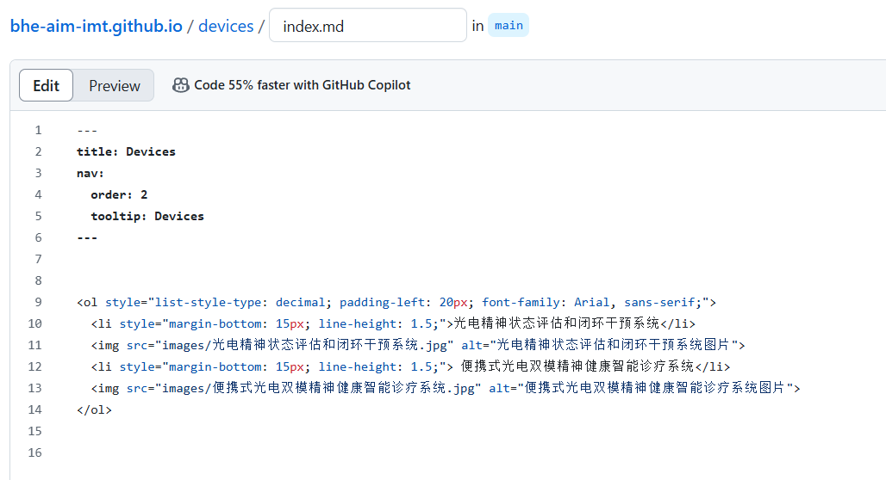

# How to update the website
## 一、更新文献
- 1、 **上传论文相关照片到image文件夹**

  - 注意图片命名，可以使用期刊_年份的形式（TCE_2024.jpg）
  - 右上角Add file - Upload files - 拖照片上传 - commit changes

- 2、 **编辑/_data/sources.yaml文件**（找到这个文件，右上角有一支笔，点击笔开始编辑）

  - 复制粘贴doi、摘要(放在description)、照片路径、日期信息，格式如下：

  - ```
    - id: doi:10.1109/BIBM58861.2023.10385577
      description: |
        Mental fatigue is a prevalent.....This innovative approach offers a promising avenue for objectively assessing and addressing mental fatigue through aromatherapy interventions.
      image: images/tian_5.jpg
    ```

  - 编辑好之后，点右上角commit changes

  - 编辑完之后，可以在Actions（网站最上面，头像下面那排，code、issues旁边）看看更新进度，有没有报错，要是有报错应该是格式问题，*/_data/citations.yaml不需要编辑，会自动生成*


## 二、网站写一个新模块（如网站右上角team、thesis）

以建devices为例

- 1、左上角加号新建文件夹，bhe-aim-imt.github.io/输入devices，打一个斜杠再输入index.md，在下面输入框中输入以下内容

  

```html
---
title: Devices
nav:
  order: 2
  tooltip: Devices
---

<ol style="list-style-type: decimal; padding-left: 20px; font-family: Arial, sans-serif;">
  <li style="margin-bottom: 15px; line-height: 1.5;">便携式光电双模精神健康智能诊疗系统</li>

 # 放图片方法一：简单放图片上去
  

 # 放图片方法二：如果要缩放图片，用下面这三行，修改style="width:60%
<div style="text-align:center;">
    
  </div>

  <li style="margin-bottom: 15px; line-height: 1.5;"> 便携式光电双模精神健康智能诊疗系统</li>
</ol>
```
    -----------------------------解释如下----------------------------------
    
    -> title 用于指定当前页面的标题为 “Devices” 。在网页中，这个标题会显示在右上角
    -> nav:：这是自定义的一个元数据属性，用于配置与导航相关的信息。
    -> order: 2：值为 2 意味着该页面在导航栏中的排序是第 2 位。
    -> tooltip: Devices：这也是 nav 配置中的属性，tooltip 用于设置鼠标悬停在导航项上时显示的提示信息，这里提示信息为 “Devices” 。
    ---：结束头部元数据部分，标志着实际内容部分的开始。
    
    -> list-style-type: decimal 表示列表项的编号样式为阿拉伯数字（即 1, 2, 3 等）
    -> padding-left: 20px 表示列表整体左内边距为 20 像素
    -> font-family: Arial, sans-serif 则指定列表文字的字体为 Arial 或系统默认的 sans-serif 字体
    -> style 属性设置了 margin-bottom: 15px 即列表项底部外边距为 15 像素
    -> line-height: 1.5 表示行高为 1.5 倍字体高度，“光电精神状态评估和闭环干预系统” 是该列表项的文本内容。
    -> 放图片： （有两种方法，写在上面代码的注释里了）
      - **注意！**，注意图片位置和你当前md文件位置的关系，如果当前文件不在最外面，记得前面加'../'返回上一级目录。
        - 举例：本md文件在最外面，和images文件夹并列，可直接写
        - 如果是devices文件夹中的md文件，需要写

## 三、team部分更新
- 1、 **上传新同学信息**  
