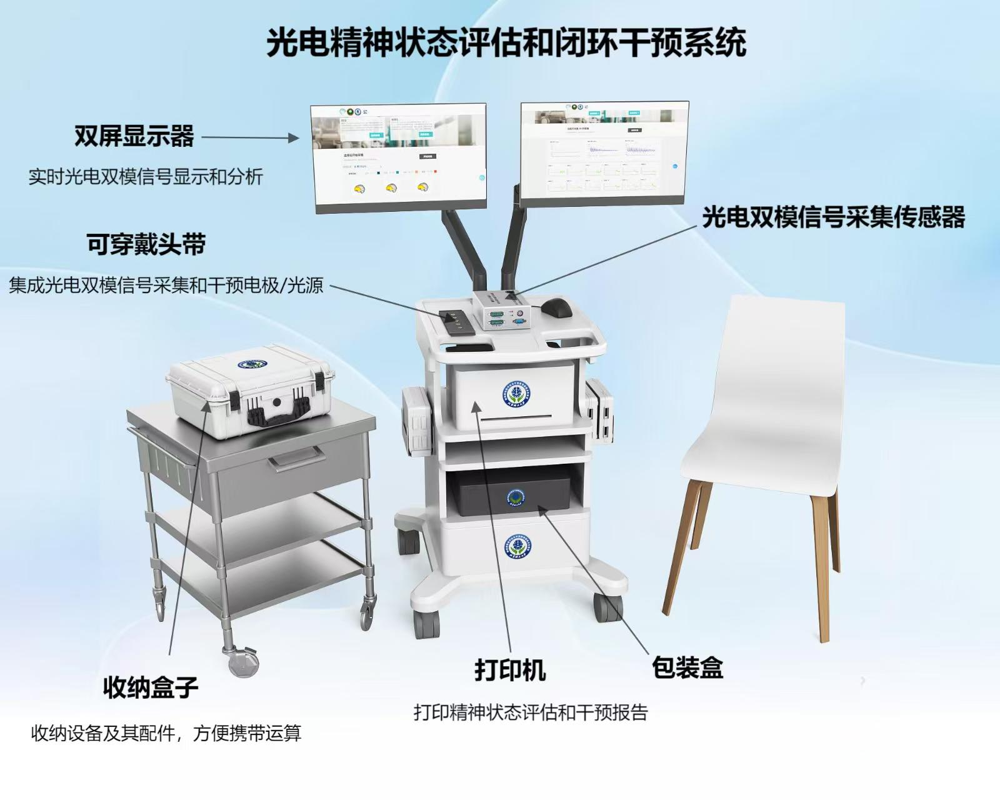
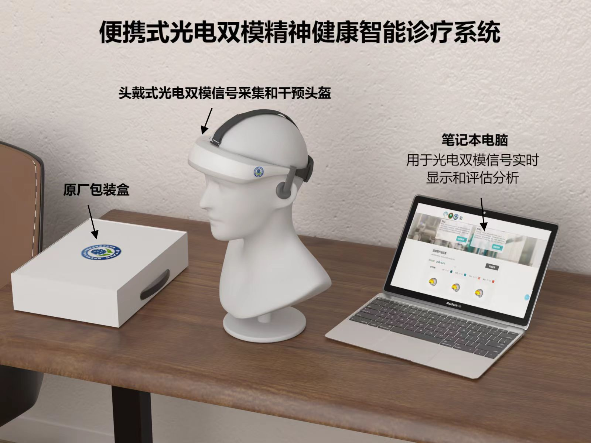
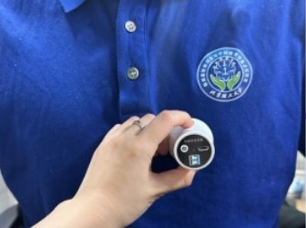
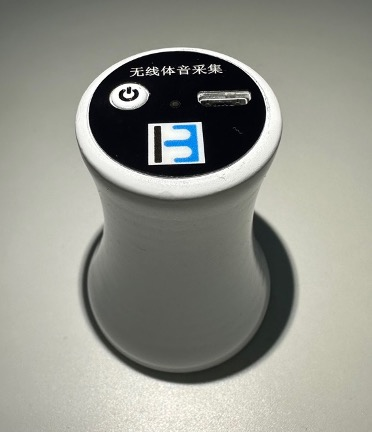

<ol style="list-style-type: decimal; padding-left: 20px; font-family: Arial, sans-serif;">
  <li style="margin-bottom: 15px; line-height: 1.5;">光电精神状态评估和闭环干预系统</li>
  
  

    
  

  
  <li style="margin-bottom: 15px; line-height: 1.5;">便携式光电双模精神健康智能诊疗系统</li>
  
  

    
  

  <li style="margin-bottom: 15px; line-height: 1.5;">体音采集系统</li>

  

    
  

  

    
  

</ol>
